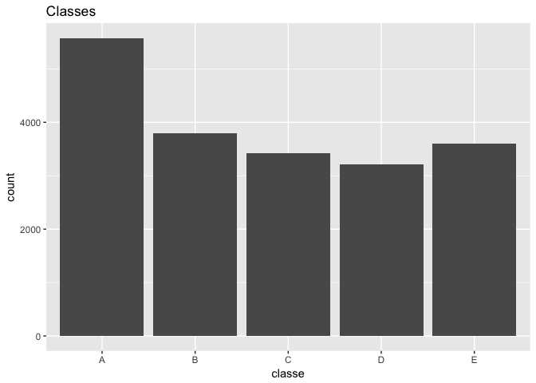

Practical Machine Learning Week 4 Assignment
================
Rosliza Hamzah
12/13/2017

output: rmarkdown::github\_document

Section 1. Overview:
--------------------

The provided dataset (refer to Section 2.1) was based on a research project entitled, *Human Activity Recognition*. (Please refer to *"Section 6 References:"* for more information.) The given dataset basically contains weight lifting exercises performed by 6 participants. The participants were asked to perform barbell lifts *correctly and incorrectly in 5 different ways*. The datasets was recorded using a customized wearable devices that consist of accelerometers. The objective of this assignment is to utilize the given dataset and **predict the manner in which the participants performed the exercise,** leverage on the variable,`classe`.

Section 2. Downloading Data & Exploratory Data Analysis:
--------------------------------------------------------

Section 2 is divided into 2 sub sections; "Downloading Data"" and "Exploratory Data Analysis"

### Section 2.1 Downloading Data:

First, we download the 2 datasets from the following URL link:

1.  Training Raw Data: <https://d396qusza40orc.cloudfront.net/predmachlearn/pml-training.csv>

2.  Test Raw Data: <https://d396qusza40orc.cloudfront.net/predmachlearn/pml-testing.csv>

``` r
# set the URL for the download
url_train_data <- "https://d396qusza40orc.cloudfront.net/predmachlearn/pml-training.csv"
url_test_test <- "https://d396qusza40orc.cloudfront.net/predmachlearn/pml-testing.csv"

file_training_set = file.path("rawdataset","pml-training.csv")
file_testing_set = file.path("rawdataset","pml-testing.csv")

# download the datasets
if (!file.exists(file_training_set) || !file.exists(file_testing_set)){
    if(!dir.exists(file.path("rawdataset"))){
        dir.create("rawdataset")
    }
    download.file(url_train_data, file_training_set, method="curl")
    download.file(url_test_test, file_testing_set, method="curl")
}

# assign into variables
train.dataset.raw <- read.csv(file_training_set, na.strings = c("NA", ""))
test.dataset.raw <- read.csv(file_testing_set, na.strings = c("NA", ""))
```

After the the data is successfully downloaded, we assigned the 2 raw datasets into 2 variables, namely, `train.dataset.raw`, `test.dataset.raw` respectively.

### Section 2.2 Exploratory Data Analysis:

Both raw datasets (`train.dataset.raw` and `test.dataset.raw`) contains the same type and total number of columns (160). The `train.dataset.raw` set contains 19622 entries, while the `test.dataset.raw` contains 20 entries. We have also identify there are many *"NA"*, values exist in the both datasets, which should be cleansed. Based on our observation, there are 7 types of columns observed as identifiers such as `X`, `user_name`, `raw_timestamp_part_1`, `raw_timestamp_part_2`, `cvtd_timestamp`, `new_window` and `num_window`, which need to be removed as well. Please refer to ***Appendix A - `train.dataset.raw` Dataset Structure*** to view the train raw data.

``` r
dimension_train_raw <- dim(train.dataset.raw)
dimension_test_raw <- dim(test.dataset.raw)
num_of_NA_raw_train <- colSums(is.na(train.dataset.raw))
num_of_NA_raw_test <- colSums(is.na(test.dataset.raw))
class_tbl_output <- table(train.dataset.raw$classe)
```

Exploring the `classe` column data within the `train.dataset.raw` dataset, indicates that there are 5 types, based on the table output code chunk (`class_tbl_output`), the `classe` with the values *"A"*, have more entires as compared to others. Please refer to the ***Appendix B - Histrogram of `classe`, - `train.dataset.raw`***

Section 3. Data Cleansing.
--------------------------

Based on data exploration analysis findings, we shall remove the 7 columns mentioned previously and the *"NA"* value entries for both `train.dataset.raw` and `test.dataset.raw` and assigned into 2 new variables as cleansed datasets.

``` r
## Cleansing raw train 'NA' column & column 1-7 as identifier column
train.dataset.clean <- train.dataset.raw[, colSums(is.na(train.dataset.raw)) == 0]
train.dataset.clean <- train.dataset.clean[, -c(1:7)]

## Cleansing raw test 'NA' column & column 1-7 as identifier column
test.dataset.clean <- test.dataset.raw[, colSums(is.na(test.dataset.raw)) == 0]
test.dataset.clean <- test.dataset.clean[, -c(1:7)]

dim(train.dataset.clean)
```

    ## [1] 19622    53

``` r
dim(test.dataset.clean)
```

    ## [1] 20 53

After cleansing, we now, have 53 variables (columns) for both datasets known as `train.dataset.clean` & `test.dataset.clean`. Please refer to ***Appendix C - List of Variables for `train.dataset.clean`***

Section 4. Constructing Prediction Model:
-----------------------------------------

Section 4 is divided into 4 sub sections; *"Partitioning `train.dataset.clean`"*, *"Using Random Forest Algorithm"*, *"Using Decision Tree"* and *Accuracy Level Results*.

### Section 4.1 Partitioning `train.dataset.clean`:

The cleansed training dataset (`train.dataset.clean`) will be divided into 2 partitions :-

1.  Training Set (`trainset`) - allocate: 70%
2.  Test Validation Set (`crossvalidationset`) - allocate: 30%

``` r
inTrain <- createDataPartition(y=train.dataset.clean$classe, p=0.7, list = FALSE)
trainset <- train.dataset.clean[inTrain,]
testvalidationset <- train.dataset.clean[-inTrain,]
```

*Decision Tree* and *Random Forest Algorithm* model will be applied into the partition data `trainset` and `testvalidationset`. The highest accuracy between the 2 model will be the chosen predictor model.

### Section 4.2 Using Random Forest Algorithm:

We use **Random Forest Algorithm** to *fit* the `classe` variable with `trainset` dataset mentioned above and assigned into another variable known as `rf.model.fit` The `rf.model.fit` variable will used to perform prediction for `testvalidationset` and inspect the *Random Forest* accuracy level leverage on *confusionMatrix* function.

``` r
set.seed(1234)

## create prediction model using Random Forest Algorithm
rf.model.fit <- randomForest(classe ~ ., data=trainset, method="class", importance=TRUE, 
                          proximity=TRUE, ntree=30)

## predict for "testvalidationset" (the 30% partition data) based on Random Forest fit Model
rf.predict <- predict(rf.model.fit, testvalidationset)

## evaluate prediction model
rf.confusion.matrix <- confusionMatrix(rf.predict, testvalidationset$classe)
```

### Secion 4.3 Using Decision Tree:

We use **Decision Tree** to *fit* the `classe` variable with `trainset` variable and assigned into a variable known as `dc.model.fit` The `dc.model.fit` variable will used to perform prediction using `testvalidationset` and inspect the *Decision Tree* accuracy level leverage on *confusionMatrix* function.

``` r
set.seed(4567)

## create prediction model using Decision Tree
dc.model.fit <- rpart(classe ~ ., data=testvalidationset, method="class")

# prediction based on Decision Tree
dc.predict <- predict(dc.model.fit, newdata=testvalidationset, type="class")

## evaluate Decision Tree prediction model accuracy
dc.confusion.matrix <- confusionMatrix(dc.predict, testvalidationset$classe)
```

### Section 4.4 Accuracy Level Results:

The `testvalidationset` using *Random Forest Algorithm* indicates that the accuracy is 99%. The output detail is provided in ***Appendix D - Random Forest Algorithm Confusion Matrix Output***. The `testvalidationset` using *Decision Tree* indicates that the accuracy is 76%. The output detail is provided in ***Appendix E - Decision Tree Confusion Matrix Output***.

Comparing the above mentioned, *"Random Forest Algorithm"* is much more ideal model as compared to *"Decision Tree"* based on its accuracy level.

Section 5. Applying The Highest Accuracy Model into `test.dataset.clean`:
-------------------------------------------------------------------------

Based on the accuracy level result decsribed above, we will apply *Random Forest Algorithm* the predictor model for `test.dataset.clean` dataset and generate the `classe` prediction output values. The below mentioned output (`final.predict`) will be used to answer Week 4 quiz.

``` r
final.predict <- predict(rf.model.fit, test.dataset.clean)
final.predict
```

    ##  1  2  3  4  5  6  7  8  9 10 11 12 13 14 15 16 17 18 19 20 
    ##  B  A  B  A  A  E  D  B  A  A  B  C  B  A  E  E  A  B  B  B 
    ## Levels: A B C D E

Section 6. References:
----------------------

Ugulino, W.; Cardador, D.; Vega, K.; Velloso, E.; Milidiu, R.; Fuks, H. Wearable Computing: Accelerometers Data Classification of Body Postures and Movements. Proceedings of 21st Brazilian Symposium on Artificial Intelligence. Advances in Artificial Intelligence - SBIA 2012. In: Lecture Notes in Computer Science. , pp. 52-61. Curitiba, PR: Springer Berlin / Heidelberg, 2012. ISBN 978-3-642-34458-9. DOI: 10.1007/978-3-642-34459-6\_6. <http://groupware.les.inf.puc-rio.br/har>

------------------------------------------------------------------------

Section 7. Appendixes:
----------------------

### Appendix A - `train.dataset.raw` Dataset Structure:

``` r
str(train.dataset.raw)
```

    ## 'data.frame':    19622 obs. of  160 variables:
    ##  $ X                       : int  1 2 3 4 5 6 7 8 9 10 ...
    ##  $ user_name               : Factor w/ 6 levels "adelmo","carlitos",..: 2 2 2 2 2 2 2 2 2 2 ...
    ##  $ raw_timestamp_part_1    : int  1323084231 1323084231 1323084231 1323084232 1323084232 1323084232 1323084232 1323084232 1323084232 1323084232 ...
    ##  $ raw_timestamp_part_2    : int  788290 808298 820366 120339 196328 304277 368296 440390 484323 484434 ...
    ##  $ cvtd_timestamp          : Factor w/ 20 levels "02/12/2011 13:32",..: 9 9 9 9 9 9 9 9 9 9 ...
    ##  $ new_window              : Factor w/ 2 levels "no","yes": 1 1 1 1 1 1 1 1 1 1 ...
    ##  $ num_window              : int  11 11 11 12 12 12 12 12 12 12 ...
    ##  $ roll_belt               : num  1.41 1.41 1.42 1.48 1.48 1.45 1.42 1.42 1.43 1.45 ...
    ##  $ pitch_belt              : num  8.07 8.07 8.07 8.05 8.07 8.06 8.09 8.13 8.16 8.17 ...
    ##  $ yaw_belt                : num  -94.4 -94.4 -94.4 -94.4 -94.4 -94.4 -94.4 -94.4 -94.4 -94.4 ...
    ##  $ total_accel_belt        : int  3 3 3 3 3 3 3 3 3 3 ...
    ##  $ kurtosis_roll_belt      : Factor w/ 396 levels "#DIV/0!","-0.016850",..: NA NA NA NA NA NA NA NA NA NA ...
    ##  $ kurtosis_picth_belt     : Factor w/ 316 levels "#DIV/0!","-0.021887",..: NA NA NA NA NA NA NA NA NA NA ...
    ##  $ kurtosis_yaw_belt       : Factor w/ 1 level "#DIV/0!": NA NA NA NA NA NA NA NA NA NA ...
    ##  $ skewness_roll_belt      : Factor w/ 394 levels "#DIV/0!","-0.003095",..: NA NA NA NA NA NA NA NA NA NA ...
    ##  $ skewness_roll_belt.1    : Factor w/ 337 levels "#DIV/0!","-0.005928",..: NA NA NA NA NA NA NA NA NA NA ...
    ##  $ skewness_yaw_belt       : Factor w/ 1 level "#DIV/0!": NA NA NA NA NA NA NA NA NA NA ...
    ##  $ max_roll_belt           : num  NA NA NA NA NA NA NA NA NA NA ...
    ##  $ max_picth_belt          : int  NA NA NA NA NA NA NA NA NA NA ...
    ##  $ max_yaw_belt            : Factor w/ 67 levels "#DIV/0!","-0.1",..: NA NA NA NA NA NA NA NA NA NA ...
    ##  $ min_roll_belt           : num  NA NA NA NA NA NA NA NA NA NA ...
    ##  $ min_pitch_belt          : int  NA NA NA NA NA NA NA NA NA NA ...
    ##  $ min_yaw_belt            : Factor w/ 67 levels "#DIV/0!","-0.1",..: NA NA NA NA NA NA NA NA NA NA ...
    ##  $ amplitude_roll_belt     : num  NA NA NA NA NA NA NA NA NA NA ...
    ##  $ amplitude_pitch_belt    : int  NA NA NA NA NA NA NA NA NA NA ...
    ##  $ amplitude_yaw_belt      : Factor w/ 3 levels "#DIV/0!","0.00",..: NA NA NA NA NA NA NA NA NA NA ...
    ##  $ var_total_accel_belt    : num  NA NA NA NA NA NA NA NA NA NA ...
    ##  $ avg_roll_belt           : num  NA NA NA NA NA NA NA NA NA NA ...
    ##  $ stddev_roll_belt        : num  NA NA NA NA NA NA NA NA NA NA ...
    ##  $ var_roll_belt           : num  NA NA NA NA NA NA NA NA NA NA ...
    ##  $ avg_pitch_belt          : num  NA NA NA NA NA NA NA NA NA NA ...
    ##  $ stddev_pitch_belt       : num  NA NA NA NA NA NA NA NA NA NA ...
    ##  $ var_pitch_belt          : num  NA NA NA NA NA NA NA NA NA NA ...
    ##  $ avg_yaw_belt            : num  NA NA NA NA NA NA NA NA NA NA ...
    ##  $ stddev_yaw_belt         : num  NA NA NA NA NA NA NA NA NA NA ...
    ##  $ var_yaw_belt            : num  NA NA NA NA NA NA NA NA NA NA ...
    ##  $ gyros_belt_x            : num  0 0.02 0 0.02 0.02 0.02 0.02 0.02 0.02 0.03 ...
    ##  $ gyros_belt_y            : num  0 0 0 0 0.02 0 0 0 0 0 ...
    ##  $ gyros_belt_z            : num  -0.02 -0.02 -0.02 -0.03 -0.02 -0.02 -0.02 -0.02 -0.02 0 ...
    ##  $ accel_belt_x            : int  -21 -22 -20 -22 -21 -21 -22 -22 -20 -21 ...
    ##  $ accel_belt_y            : int  4 4 5 3 2 4 3 4 2 4 ...
    ##  $ accel_belt_z            : int  22 22 23 21 24 21 21 21 24 22 ...
    ##  $ magnet_belt_x           : int  -3 -7 -2 -6 -6 0 -4 -2 1 -3 ...
    ##  $ magnet_belt_y           : int  599 608 600 604 600 603 599 603 602 609 ...
    ##  $ magnet_belt_z           : int  -313 -311 -305 -310 -302 -312 -311 -313 -312 -308 ...
    ##  $ roll_arm                : num  -128 -128 -128 -128 -128 -128 -128 -128 -128 -128 ...
    ##  $ pitch_arm               : num  22.5 22.5 22.5 22.1 22.1 22 21.9 21.8 21.7 21.6 ...
    ##  $ yaw_arm                 : num  -161 -161 -161 -161 -161 -161 -161 -161 -161 -161 ...
    ##  $ total_accel_arm         : int  34 34 34 34 34 34 34 34 34 34 ...
    ##  $ var_accel_arm           : num  NA NA NA NA NA NA NA NA NA NA ...
    ##  $ avg_roll_arm            : num  NA NA NA NA NA NA NA NA NA NA ...
    ##  $ stddev_roll_arm         : num  NA NA NA NA NA NA NA NA NA NA ...
    ##  $ var_roll_arm            : num  NA NA NA NA NA NA NA NA NA NA ...
    ##  $ avg_pitch_arm           : num  NA NA NA NA NA NA NA NA NA NA ...
    ##  $ stddev_pitch_arm        : num  NA NA NA NA NA NA NA NA NA NA ...
    ##  $ var_pitch_arm           : num  NA NA NA NA NA NA NA NA NA NA ...
    ##  $ avg_yaw_arm             : num  NA NA NA NA NA NA NA NA NA NA ...
    ##  $ stddev_yaw_arm          : num  NA NA NA NA NA NA NA NA NA NA ...
    ##  $ var_yaw_arm             : num  NA NA NA NA NA NA NA NA NA NA ...
    ##  $ gyros_arm_x             : num  0 0.02 0.02 0.02 0 0.02 0 0.02 0.02 0.02 ...
    ##  $ gyros_arm_y             : num  0 -0.02 -0.02 -0.03 -0.03 -0.03 -0.03 -0.02 -0.03 -0.03 ...
    ##  $ gyros_arm_z             : num  -0.02 -0.02 -0.02 0.02 0 0 0 0 -0.02 -0.02 ...
    ##  $ accel_arm_x             : int  -288 -290 -289 -289 -289 -289 -289 -289 -288 -288 ...
    ##  $ accel_arm_y             : int  109 110 110 111 111 111 111 111 109 110 ...
    ##  $ accel_arm_z             : int  -123 -125 -126 -123 -123 -122 -125 -124 -122 -124 ...
    ##  $ magnet_arm_x            : int  -368 -369 -368 -372 -374 -369 -373 -372 -369 -376 ...
    ##  $ magnet_arm_y            : int  337 337 344 344 337 342 336 338 341 334 ...
    ##  $ magnet_arm_z            : int  516 513 513 512 506 513 509 510 518 516 ...
    ##  $ kurtosis_roll_arm       : Factor w/ 329 levels "#DIV/0!","-0.02438",..: NA NA NA NA NA NA NA NA NA NA ...
    ##  $ kurtosis_picth_arm      : Factor w/ 327 levels "#DIV/0!","-0.00484",..: NA NA NA NA NA NA NA NA NA NA ...
    ##  $ kurtosis_yaw_arm        : Factor w/ 394 levels "#DIV/0!","-0.01548",..: NA NA NA NA NA NA NA NA NA NA ...
    ##  $ skewness_roll_arm       : Factor w/ 330 levels "#DIV/0!","-0.00051",..: NA NA NA NA NA NA NA NA NA NA ...
    ##  $ skewness_pitch_arm      : Factor w/ 327 levels "#DIV/0!","-0.00184",..: NA NA NA NA NA NA NA NA NA NA ...
    ##  $ skewness_yaw_arm        : Factor w/ 394 levels "#DIV/0!","-0.00311",..: NA NA NA NA NA NA NA NA NA NA ...
    ##  $ max_roll_arm            : num  NA NA NA NA NA NA NA NA NA NA ...
    ##  $ max_picth_arm           : num  NA NA NA NA NA NA NA NA NA NA ...
    ##  $ max_yaw_arm             : int  NA NA NA NA NA NA NA NA NA NA ...
    ##  $ min_roll_arm            : num  NA NA NA NA NA NA NA NA NA NA ...
    ##  $ min_pitch_arm           : num  NA NA NA NA NA NA NA NA NA NA ...
    ##  $ min_yaw_arm             : int  NA NA NA NA NA NA NA NA NA NA ...
    ##  $ amplitude_roll_arm      : num  NA NA NA NA NA NA NA NA NA NA ...
    ##  $ amplitude_pitch_arm     : num  NA NA NA NA NA NA NA NA NA NA ...
    ##  $ amplitude_yaw_arm       : int  NA NA NA NA NA NA NA NA NA NA ...
    ##  $ roll_dumbbell           : num  13.1 13.1 12.9 13.4 13.4 ...
    ##  $ pitch_dumbbell          : num  -70.5 -70.6 -70.3 -70.4 -70.4 ...
    ##  $ yaw_dumbbell            : num  -84.9 -84.7 -85.1 -84.9 -84.9 ...
    ##  $ kurtosis_roll_dumbbell  : Factor w/ 397 levels "#DIV/0!","-0.0035",..: NA NA NA NA NA NA NA NA NA NA ...
    ##  $ kurtosis_picth_dumbbell : Factor w/ 400 levels "#DIV/0!","-0.0163",..: NA NA NA NA NA NA NA NA NA NA ...
    ##  $ kurtosis_yaw_dumbbell   : Factor w/ 1 level "#DIV/0!": NA NA NA NA NA NA NA NA NA NA ...
    ##  $ skewness_roll_dumbbell  : Factor w/ 400 levels "#DIV/0!","-0.0082",..: NA NA NA NA NA NA NA NA NA NA ...
    ##  $ skewness_pitch_dumbbell : Factor w/ 401 levels "#DIV/0!","-0.0053",..: NA NA NA NA NA NA NA NA NA NA ...
    ##  $ skewness_yaw_dumbbell   : Factor w/ 1 level "#DIV/0!": NA NA NA NA NA NA NA NA NA NA ...
    ##  $ max_roll_dumbbell       : num  NA NA NA NA NA NA NA NA NA NA ...
    ##  $ max_picth_dumbbell      : num  NA NA NA NA NA NA NA NA NA NA ...
    ##  $ max_yaw_dumbbell        : Factor w/ 72 levels "#DIV/0!","-0.1",..: NA NA NA NA NA NA NA NA NA NA ...
    ##  $ min_roll_dumbbell       : num  NA NA NA NA NA NA NA NA NA NA ...
    ##  $ min_pitch_dumbbell      : num  NA NA NA NA NA NA NA NA NA NA ...
    ##  $ min_yaw_dumbbell        : Factor w/ 72 levels "#DIV/0!","-0.1",..: NA NA NA NA NA NA NA NA NA NA ...
    ##  $ amplitude_roll_dumbbell : num  NA NA NA NA NA NA NA NA NA NA ...
    ##   [list output truncated]

### Appendix B - Histogram of `classe` - `train.dataset.raw`:

``` r
ggplot(data = train.dataset.clean, aes(x=classe)) +
    geom_histogram(stat = "count") +
    scale_x_discrete(name = "classe") +
    scale_y_continuous(name = "count") +
    ggtitle("Classes")
```



### Appendix C - List of Variables For `train.dataset.clean`:

``` r
names(train.dataset.clean)
```

    ##  [1] "roll_belt"            "pitch_belt"           "yaw_belt"            
    ##  [4] "total_accel_belt"     "gyros_belt_x"         "gyros_belt_y"        
    ##  [7] "gyros_belt_z"         "accel_belt_x"         "accel_belt_y"        
    ## [10] "accel_belt_z"         "magnet_belt_x"        "magnet_belt_y"       
    ## [13] "magnet_belt_z"        "roll_arm"             "pitch_arm"           
    ## [16] "yaw_arm"              "total_accel_arm"      "gyros_arm_x"         
    ## [19] "gyros_arm_y"          "gyros_arm_z"          "accel_arm_x"         
    ## [22] "accel_arm_y"          "accel_arm_z"          "magnet_arm_x"        
    ## [25] "magnet_arm_y"         "magnet_arm_z"         "roll_dumbbell"       
    ## [28] "pitch_dumbbell"       "yaw_dumbbell"         "total_accel_dumbbell"
    ## [31] "gyros_dumbbell_x"     "gyros_dumbbell_y"     "gyros_dumbbell_z"    
    ## [34] "accel_dumbbell_x"     "accel_dumbbell_y"     "accel_dumbbell_z"    
    ## [37] "magnet_dumbbell_x"    "magnet_dumbbell_y"    "magnet_dumbbell_z"   
    ## [40] "roll_forearm"         "pitch_forearm"        "yaw_forearm"         
    ## [43] "total_accel_forearm"  "gyros_forearm_x"      "gyros_forearm_y"     
    ## [46] "gyros_forearm_z"      "accel_forearm_x"      "accel_forearm_y"     
    ## [49] "accel_forearm_z"      "magnet_forearm_x"     "magnet_forearm_y"    
    ## [52] "magnet_forearm_z"     "classe"

### Appendix D - Random Forest Algorithm Confusion Matrix Output:

``` r
rf.confusion.matrix
```

    ## Confusion Matrix and Statistics
    ## 
    ##           Reference
    ## Prediction    A    B    C    D    E
    ##          A 1674   15    0    0    0
    ##          B    0 1121    8    0    0
    ##          C    0    3 1016   12    1
    ##          D    0    0    2  951    0
    ##          E    0    0    0    1 1081
    ## 
    ## Overall Statistics
    ##                                           
    ##                Accuracy : 0.9929          
    ##                  95% CI : (0.9904, 0.9949)
    ##     No Information Rate : 0.2845          
    ##     P-Value [Acc > NIR] : < 2.2e-16       
    ##                                           
    ##                   Kappa : 0.991           
    ##  Mcnemar's Test P-Value : NA              
    ## 
    ## Statistics by Class:
    ## 
    ##                      Class: A Class: B Class: C Class: D Class: E
    ## Sensitivity            1.0000   0.9842   0.9903   0.9865   0.9991
    ## Specificity            0.9964   0.9983   0.9967   0.9996   0.9998
    ## Pos Pred Value         0.9911   0.9929   0.9845   0.9979   0.9991
    ## Neg Pred Value         1.0000   0.9962   0.9979   0.9974   0.9998
    ## Prevalence             0.2845   0.1935   0.1743   0.1638   0.1839
    ## Detection Rate         0.2845   0.1905   0.1726   0.1616   0.1837
    ## Detection Prevalence   0.2870   0.1918   0.1754   0.1619   0.1839
    ## Balanced Accuracy      0.9982   0.9913   0.9935   0.9931   0.9994

### Appendix E - Decision Tree Confusion Matrix Output:

``` r
dc.confusion.matrix
```

    ## Confusion Matrix and Statistics
    ## 
    ##           Reference
    ## Prediction    A    B    C    D    E
    ##          A 1502  162   24   33   21
    ##          B   43  710   95   84  118
    ##          C   50  177  836  104  125
    ##          D   73   66   66  735  123
    ##          E    6   24    5    8  695
    ## 
    ## Overall Statistics
    ##                                           
    ##                Accuracy : 0.7609          
    ##                  95% CI : (0.7498, 0.7718)
    ##     No Information Rate : 0.2845          
    ##     P-Value [Acc > NIR] : < 2.2e-16       
    ##                                           
    ##                   Kappa : 0.6975          
    ##  Mcnemar's Test P-Value : < 2.2e-16       
    ## 
    ## Statistics by Class:
    ## 
    ##                      Class: A Class: B Class: C Class: D Class: E
    ## Sensitivity            0.8973   0.6234   0.8148   0.7624   0.6423
    ## Specificity            0.9430   0.9284   0.9062   0.9333   0.9910
    ## Pos Pred Value         0.8622   0.6762   0.6471   0.6914   0.9417
    ## Neg Pred Value         0.9585   0.9113   0.9586   0.9525   0.9248
    ## Prevalence             0.2845   0.1935   0.1743   0.1638   0.1839
    ## Detection Rate         0.2552   0.1206   0.1421   0.1249   0.1181
    ## Detection Prevalence   0.2960   0.1784   0.2195   0.1806   0.1254
    ## Balanced Accuracy      0.9201   0.7759   0.8605   0.8479   0.8167
